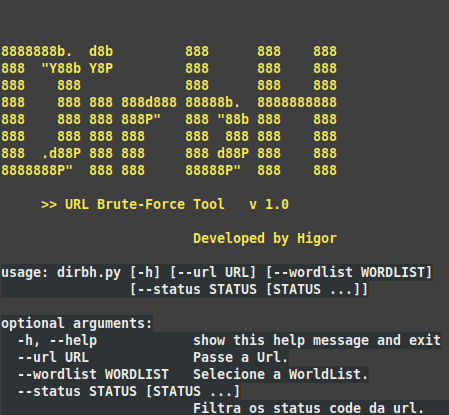

# DirbH
  

<br>Simples ferramenta de brute-force escrita em Python.<br>
# Screenshot


- [x] Modo de uso: ```python3 dirbh.py --url [url] --wordlist [wordlist_file] --status 2xx 3xx ```
# setup
<b>Modulos necessarios</b>: ```queue``` e ```argparse```<br>
<b>Instalação de Modulos</b>: ```pip3 install -r requirements.txt```<br>

# Arguments  
- --url: Especifique a Url. Ex: => http://192.168.1.1
- --wordlist: Selecione o aquivo da Wordlist. Ex: => /usr/share/wordlists/dirb/common.txt
- --status: Filtre os status code. Ex: => 200 301 403

#### Não me responsabilizo pelo uso indevido desse Script!

See you soon..... :)

